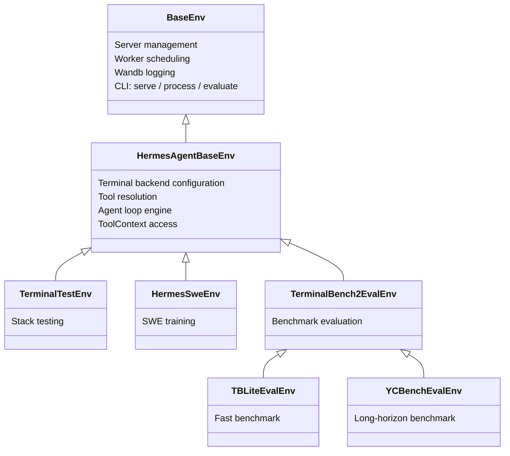

# 环境、基准测试与数据生成

Hermes Agent 包含一套完整的环境框架，将其工具调用能力与 [Atropos](https://github.com/NousResearch/atropos) RL 训练框架相连接。这套框架支持三种工作流：

1. **RL 训练** — 使用 GRPO 在多轮 Agent 任务上训练语言模型
2. **基准测试** — 在标准化的 Agent 基准上评估模型
3. **数据生成** — 从 Agent rollout 中生成 SFT 训练数据

三者共用同一个核心：**环境（environment）** 类，用于定义任务、运行 Agent 循环并对输出进行打分。

:::info
仓库环境与 RL 训练工具的区别
本文档介绍的 Python 环境框架位于仓库的 `environments/` 目录下，是 Hermes/Atropos 集成的实现层 API。它与面向用户的 `rl_*` 工具不同，后者作为远程 RL 训练工作流的编排入口。
:::

:::tip
快速导航
- **想运行基准测试？** 跳转至[可用基准测试](#available-benchmarks)
- **想使用 RL 训练？** 参阅 [RL 训练工具](/user-guide/features/rl-training)（Agent 驱动接口），或[运行环境](#running-environments)（手动执行）
- **想创建新环境？** 参阅[创建环境](#creating-environments)
:::

## 架构

环境系统基于三层继承链构建：



### BaseEnv（Atropos）

来自 `atroposlib` 的基础层，提供：
- **Server 管理** — 连接兼容 OpenAI 的 API（VLLM、SGLang、OpenRouter）
- **Worker 调度** — 并行 rollout 协调
- **Wandb 集成** — 指标记录与 rollout 可视化
- **CLI 接口** — 三个子命令：`serve`、`process`、`evaluate`
- **评估日志** — `evaluate_log()` 将结果保存为 JSON + JSONL

### HermesAgentBaseEnv

Hermes Agent 层（`environments/hermes_base_env.py`），在 BaseEnv 基础上增加：
- **Terminal 后端配置** — 为沙箱执行设置 `TERMINAL_ENV`（支持 local、Docker、Modal、Daytona、SSH、Singularity）
- **工具解析** — `_resolve_tools_for_group()` 调用 hermes-agent 的 `get_tool_definitions()`，根据已启用/禁用的工具集获取对应的工具 schema
- **Agent 循环集成** — `collect_trajectory()` 运行 `HermesAgentLoop` 并对结果打分
- **两阶段运行** — 第一阶段（OpenAI server）用于评估/SFT，第二阶段（VLLM ManagedServer）用于带 logprobs 的完整 RL
- **异步安全补丁** — 对 Modal 后端进行 monkey-patch，使其在 Atropos 事件循环内正常工作

### 具体环境实现

自定义环境继承自 `HermesAgentBaseEnv`，需实现五个方法：

| 方法 | 用途 |
|--------|---------|
| `setup()` | 加载数据集，初始化状态 |
| `get_next_item()` | 返回下一个待 rollout 的任务项 |
| `format_prompt(item)` | 将任务项转换为用户消息 |
| `compute_reward(item, result, ctx)` | 对 rollout 打分（0.0–1.0） |
| `evaluate()` | 周期性评估逻辑 |

## 核心组件

### Agent 循环

`HermesAgentLoop`（`environments/agent_loop.py`）是可复用的多轮 Agent 引擎，与 hermes-agent 主循环采用相同的工具调用模式：

1. 通过 `server.chat_completion()` 将消息和工具 schema 发送至 API
2. 若响应包含 `tool_calls`，逐个通过 `handle_function_call()` 分发执行
3. 将工具执行结果追加到对话中，返回第 1 步
4. 若无 `tool_calls`，Agent 结束

工具调用在线程池（`ThreadPoolExecutor(128)`）中执行，避免异步后端（Modal、Docker）在 Atropos 事件循环内产生死锁。

返回 `AgentResult`：

```python
@dataclass
class AgentResult:
    messages: List[Dict[str, Any]]       # 完整对话历史
    turns_used: int                       # LLM 调用次数
    finished_naturally: bool              # True 表示模型自行停止
    reasoning_per_turn: List[Optional[str]]  # 每轮提取的推理内容
    tool_errors: List[ToolError]          # 工具分发过程中的错误
    managed_state: Optional[Dict]         # VLLM ManagedServer 状态（第二阶段）
```

### Tool Context

`ToolContext`（`environments/tool_context.py`）让奖励函数能够直接访问模型在 rollout 期间使用的**同一沙箱**。`task_id` 作用域确保所有状态（文件、进程、浏览器标签页）均被保留。

```python
async def compute_reward(self, item, result, ctx: ToolContext):
    # 在模型的 terminal 沙箱中运行测试
    test = ctx.terminal("pytest -v")
    if test["exit_code"] == 0:
        return 1.0

    # 检查文件是否已创建
    content = ctx.read_file("/workspace/solution.py")
    if content.get("content"):
        return 0.5

    # 下载文件进行本地验证
    ctx.download_file("/remote/output.bin", "/local/output.bin")
    return 0.0
```

可用方法：

| 类别 | 方法 |
|----------|---------|
| **Terminal** | `terminal(command, timeout)` |
| **文件** | `read_file(path)`、`write_file(path, content)`、`search(query, path)` |
| **传输** | `upload_file()`、`upload_dir()`、`download_file()`、`download_dir()` |
| **Web** | `web_search(query)`、`web_extract(urls)` |
| **浏览器** | `browser_navigate(url)`、`browser_snapshot()` |
| **通用** | `call_tool(name, args)` — 调用任意 hermes-agent 工具的通用接口 |
| **清理** | `cleanup()` — 释放所有资源 |

### 工具调用解析器

在**第二阶段**（VLLM ManagedServer），server 返回原始文本而非结构化的工具调用。`environments/tool_call_parsers/` 中的客户端解析器负责从原始输出中提取 `tool_calls`：

```python
from environments.tool_call_parsers import get_parser

parser = get_parser("hermes")  # 或 "mistral"、"llama3_json"、"qwen"、"deepseek_v3" 等
content, tool_calls = parser.parse(raw_model_output)
```

可用解析器：`hermes`、`mistral`、`llama3_json`、`qwen`、`qwen3_coder`、`deepseek_v3`、`deepseek_v3_1`、`kimi_k2`、`longcat`、`glm45`、`glm47`。

在第一阶段（OpenAI server 类型），无需解析器——server 原生处理工具调用解析。

## 可用基准测试

### TerminalBench2

**89 个高难度 terminal 任务**，每个任务配备独立的 Docker 沙箱环境。

| | |
|---|---|
| **测试内容** | 单任务编程/系统管理能力 |
| **评分方式** | 二元通过/失败（测试套件验证） |
| **沙箱** | Modal 云沙箱（每任务独立 Docker 镜像） |
| **工具** | `terminal` + `file` |
| **任务数** | 89 个，跨多个类别 |
| **成本** | 完整评估约 $50–200（并行执行） |
| **耗时** | 约 2–4 小时 |

```bash
python environments/benchmarks/terminalbench_2/terminalbench2_env.py evaluate \
    --config environments/benchmarks/terminalbench_2/default.yaml

# 运行指定任务
python environments/benchmarks/terminalbench_2/terminalbench2_env.py evaluate \
    --config environments/benchmarks/terminalbench_2/default.yaml \
    --env.task_filter fix-git,git-multibranch
```

数据集：HuggingFace 上的 [NousResearch/terminal-bench-2](https://huggingface.co/datasets/NousResearch/terminal-bench-2)。

### TBLite（OpenThoughts Terminal Bench Lite）

**100 个经过难度校准的任务** — TerminalBench2 的快速代理版本。

| | |
|---|---|
| **测试内容** | 与 TB2 相同（编程/系统管理），含难度分级 |
| **评分方式** | 二元通过/失败 |
| **沙箱** | Modal 云沙箱 |
| **工具** | `terminal` + `file` |
| **任务数** | 100 个：简单（40）、中等（26）、困难（26）、极难（8） |
| **相关性** | 与完整 TB2 的 r=0.911 |
| **速度** | 比 TB2 快 2.6–8 倍 |

```bash
python environments/benchmarks/tblite/tblite_env.py evaluate \
    --config environments/benchmarks/tblite/default.yaml
```

TBLite 是 TerminalBench2 的轻量子类，仅数据集和超时时间有所不同。由 OpenThoughts Agent 团队（Snorkel AI + Bespoke Labs）创建。数据集：[NousResearch/openthoughts-tblite](https://huggingface.co/datasets/NousResearch/openthoughts-tblite)。

### YC-Bench

**长时程策略基准测试** — Agent 扮演一家 AI 初创公司的 CEO。

| | |
|---|---|
| **测试内容** | 数百轮中的多轮策略连贯性 |
| **评分方式** | 综合得分：`0.5 × 存活率 + 0.5 × 归一化资金` |
| **沙箱** | 本地 terminal（无需 Modal） |
| **工具** | 仅 `terminal` |
| **运行次数** | 默认 9 次（3 个预设 × 3 个种子），顺序执行 |
| **成本** | 完整评估约 $50–200 |
| **耗时** | 约 3–6 小时 |

```bash
# 安装 yc-bench（可选依赖）
pip install "hermes-agent[yc-bench]"

# 运行评估
bash environments/benchmarks/yc_bench/run_eval.sh

# 或直接运行
python environments/benchmarks/yc_bench/yc_bench_env.py evaluate \
    --config environments/benchmarks/yc_bench/default.yaml

# 快速单预设测试
python environments/benchmarks/yc_bench/yc_bench_env.py evaluate \
    --config environments/benchmarks/yc_bench/default.yaml \
    --env.presets '["fast_test"]' --env.seeds '[1]'
```

YC-Bench 使用 [collinear-ai/yc-bench](https://github.com/collinear-ai/yc-bench) — 一个确定性模拟环境，包含 4 个技能领域（research、inference、data_environment、training）、声望系统、员工管理和财务压力。与 TB2 的单任务二元评分不同，YC-Bench 衡量的是 Agent 能否在数百个连环决策中保持连贯的策略。

## 训练环境

### TerminalTestEnv

一个最小化的自包含环境，使用内联任务（无需外部数据集），用于**端到端验证完整技术栈**。每个任务要求模型在指定路径创建文件，验证器负责检查文件内容。

```bash
# process 模式（将 rollout 保存为 JSONL，无需训练服务器）
python environments/terminal_test_env/terminal_test_env.py process \
    --env.data_path_to_save_groups terminal_test_output.jsonl

# serve 模式（连接 Atropos API 进行 RL 训练）
python environments/terminal_test_env/terminal_test_env.py serve
```

### HermesSweEnv

SWE-bench 风格的训练环境。模型接收编程任务，使用 terminal + file + web 工具解决问题，奖励函数在同一 Modal 沙箱中运行测试。

```bash
python environments/hermes_swe_env/hermes_swe_env.py serve \
    --openai.model_name YourModel \
    --env.dataset_name bigcode/humanevalpack \
    --env.terminal_backend modal
```

## 运行环境

每个环境都是一个独立的 Python 脚本，提供三个 CLI 子命令：

### `evaluate` — 运行基准测试

适用于仅评估的环境（基准测试）。运行所有任务项，计算指标，记录到 wandb。

```bash
python environments/benchmarks/tblite/tblite_env.py evaluate \
    --config environments/benchmarks/tblite/default.yaml \
    --openai.model_name anthropic/claude-sonnet-4.6
```

无需训练服务器或 `run-api`，环境自行处理一切。

### `process` — 生成 SFT 数据

运行 rollout 并将带评分的轨迹保存为 JSONL，适用于在不启动完整 RL 循环的情况下生成训练数据。

```bash
python environments/terminal_test_env/terminal_test_env.py process \
    --env.data_path_to_save_groups output.jsonl \
    --openai.model_name anthropic/claude-sonnet-4.6
```

输出格式：每行是一条带评分的轨迹，包含完整对话历史、奖励值和元数据。

### `serve` — 连接 Atropos 进行 RL 训练

将环境连接到运行中的 Atropos API server（`run-api`），在在线 RL 训练时使用。

```bash
# 终端 1：启动 Atropos API
run-api

# 终端 2：启动环境
python environments/hermes_swe_env/hermes_swe_env.py serve \
    --openai.model_name YourModel
```

环境从 Atropos 接收任务项，运行 Agent rollout，计算奖励，并将带评分的轨迹发回用于训练。

## 两阶段运行

### 第一阶段：OpenAI Server（评估 / SFT）

使用带 `tools=` 参数的 `server.chat_completion()`。Server（VLLM、SGLang、OpenRouter、OpenAI）原生处理工具调用解析，返回包含结构化 `tool_calls` 的 `ChatCompletion` 对象。

- **适用场景**：评估、SFT 数据生成、基准测试、功能验证
- 由于 OpenAI API 不提供真实 token ID，Atropos pipeline 使用**占位符 token**

### 第二阶段：VLLM ManagedServer（完整 RL）

通过 `/generate` 接口使用 ManagedServer 获取精确的 token ID 和 logprobs。客户端[工具调用解析器](#tool-call-parsers)从原始输出中重建结构化的 `tool_calls`。

- **适用场景**：使用 GRPO/PPO 进行完整 RL 训练
- 真实的 token、mask 和 logprobs 流经整个 pipeline
- 在配置中设置 `tool_call_parser` 以匹配模型格式（如 `"hermes"`、`"qwen"`、`"mistral"`）

## 创建环境

### 训练环境

```python
from environments.hermes_base_env import HermesAgentBaseEnv, HermesAgentEnvConfig
from atroposlib.envs.server_handling.server_manager import APIServerConfig

class MyEnvConfig(HermesAgentEnvConfig):
    my_custom_field: str = "default_value"

class MyEnv(HermesAgentBaseEnv):
    name = "my-env"
    env_config_cls = MyEnvConfig

    @classmethod
    def config_init(cls):
        env_config = MyEnvConfig(
            enabled_toolsets=["terminal", "file"],
            terminal_backend="modal",
            max_agent_turns=30,
        )
        server_configs = [APIServerConfig(
            base_url="https://openrouter.ai/api/v1",
            model_name="anthropic/claude-sonnet-4.6",
            server_type="openai",
        )]
        return env_config, server_configs

    async def setup(self):
        from datasets import load_dataset
        self.dataset = list(load_dataset("my-dataset", split="train"))
        self.iter = 0

    async def get_next_item(self):
        item = self.dataset[self.iter % len(self.dataset)]
        self.iter += 1
        return item

    def format_prompt(self, item):
        return item["instruction"]

    async def compute_reward(self, item, result, ctx):
        # ctx 提供对 rollout 沙箱的完整工具访问
        test = ctx.terminal("pytest -v")
        return 1.0 if test["exit_code"] == 0 else 0.0

    async def evaluate(self, *args, **kwargs):
        # 训练期间的周期性评估
        pass

if __name__ == "__main__":
    MyEnv.cli()
```

### 仅评估基准测试

创建基准测试时，参照 TerminalBench2、TBLite 和 YC-Bench 的实现模式：

1. **创建目录** `environments/benchmarks/your-benchmark/`
2. **设置仅评估配置**：`eval_handling=STOP_TRAIN`、`steps_per_eval=1`、`total_steps=1`
3. **桩化训练方法**：`collect_trajectories()` 返回 `(None, [])`，`score()` 返回 `None`
4. **实现** `rollout_and_score_eval(eval_item)` — 单任务项的 Agent 循环 + 评分
5. **实现** `evaluate()` — 编排所有运行，计算聚合指标
6. **添加流式 JSONL** 以保证崩溃安全的结果持久化
7. **添加清理逻辑**：`KeyboardInterrupt` 处理、`cleanup_all_environments()`、`_tool_executor.shutdown()`
8. **使用** `evaluate` 子命令运行

参阅 `environments/benchmarks/yc_bench/yc_bench_env.py` 获取简洁、注释完善的参考实现。

## 配置参考

### HermesAgentEnvConfig 字段

| 字段 | 类型 | 默认值 | 说明 |
|-------|------|---------|-------------|
| `enabled_toolsets` | `List[str]` | `None`（全部） | 启用的 hermes 工具集 |
| `disabled_toolsets` | `List[str]` | `None` | 需过滤掉的工具集 |
| `distribution` | `str` | `None` | 概率性工具集分配方案名称 |
| `max_agent_turns` | `int` | `30` | 每次 rollout 的最大 LLM 调用次数 |
| `agent_temperature` | `float` | `1.0` | 采样温度 |
| `system_prompt` | `str` | `None` | Agent 的系统消息 |
| `terminal_backend` | `str` | `"local"` | `local`、`docker`、`modal`、`daytona`、`ssh`、`singularity` |
| `terminal_timeout` | `int` | `120` | 每条 terminal 命令的超时秒数 |
| `terminal_lifetime` | `int` | `3600` | 沙箱最大存活时间 |
| `dataset_name` | `str` | `None` | HuggingFace 数据集标识符 |
| `tool_pool_size` | `int` | `128` | 工具执行线程池大小 |
| `tool_call_parser` | `str` | `"hermes"` | 第二阶段原始输出解析器 |
| `extra_body` | `Dict` | `None` | OpenAI API 额外参数（如 OpenRouter provider 偏好） |
| `eval_handling` | `Enum` | `STOP_TRAIN` | `STOP_TRAIN`、`LIMIT_TRAIN`、`NONE` |

### YAML 配置

环境可通过 `--config` 传入 YAML 文件进行配置：

```yaml
env:
  enabled_toolsets: ["terminal", "file"]
  max_agent_turns: 60
  max_token_length: 32000
  agent_temperature: 0.8
  terminal_backend: "modal"
  terminal_timeout: 300
  dataset_name: "NousResearch/terminal-bench-2"
  tokenizer_name: "NousResearch/Hermes-3-Llama-3.1-8B"
  use_wandb: true
  wandb_name: "my-benchmark"

openai:
  base_url: "https://openrouter.ai/api/v1"
  model_name: "anthropic/claude-sonnet-4.6"
  server_type: "openai"
  health_check: false
```

YAML 值会覆盖 `config_init()` 中的默认值，CLI 参数则覆盖 YAML 值：

```bash
python my_env.py evaluate \
    --config my_config.yaml \
    --openai.model_name anthropic/claude-opus-4.6  # 覆盖 YAML 中的值
```

## 前置条件

### 所有环境通用

- Python >= 3.11
- `atroposlib`：`pip install git+https://github.com/NousResearch/atropos.git`
- LLM API 密钥（OpenRouter、OpenAI 或自托管的 VLLM/SGLang）

### Modal 沙箱基准测试（TB2、TBLite）

- [Modal](https://modal.com) 账号及 CLI：`pip install "hermes-agent[modal]"`
- 环境变量 `MODAL_TOKEN_ID` 和 `MODAL_TOKEN_SECRET`

### YC-Bench

- `pip install "hermes-agent[yc-bench]"`（安装 yc-bench CLI + SQLAlchemy）
- 无需 Modal — 使用本地 terminal 后端运行

### RL 训练

- `TINKER_API_KEY` — [Tinker](https://tinker.computer) 训练服务的 API 密钥
- `WANDB_API_KEY` — 用于 Weights & Biases 指标追踪
- 仓库中的 `tinker-atropos` 子模块（位于 `tinker-atropos/`）

参阅 [RL 训练](/user-guide/features/rl-training) 了解 Agent 驱动的 RL 工作流。

## 目录结构

```
environments/
├── hermes_base_env.py          # 抽象基类（HermesAgentBaseEnv）
├── agent_loop.py               # 多轮 Agent 引擎（HermesAgentLoop）
├── tool_context.py             # 奖励函数的 per-rollout 工具访问
├── patches.py                  # Modal 后端的异步安全补丁
│
├── tool_call_parsers/          # 第二阶段客户端解析器
│   ├── hermes_parser.py        # Hermes/ChatML <tool_call> 格式
│   ├── mistral_parser.py       # Mistral [TOOL_CALLS] 格式
│   ├── llama_parser.py         # Llama 3 JSON 工具调用
│   ├── qwen_parser.py          # Qwen 格式
│   ├── deepseek_v3_parser.py   # DeepSeek V3 格式
│   └── ...                     # + kimi_k2、longcat、glm45/47 等
│
├── terminal_test_env/          # 全栈验证（内联任务）
├── hermes_swe_env/             # SWE-bench 训练环境
│
└── benchmarks/                 # 评估基准测试
    ├── terminalbench_2/        # 89 个 terminal 任务，Modal 沙箱
    ├── tblite/                 # 100 个校准任务（TB2 快速代理版）
    └── yc_bench/               # 长时程策略基准测试
```
