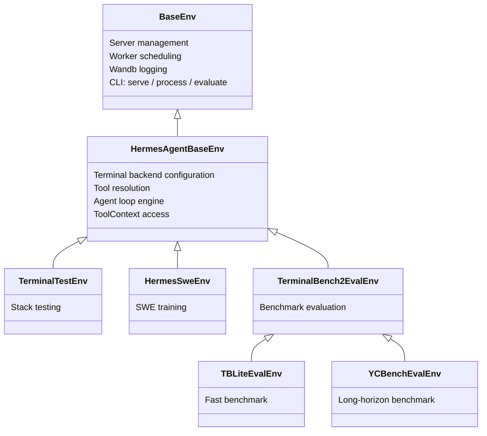

# Environments, Benchmarks & Data Generation

Hermes Agent includes a full environment framework that connects its tool-calling capabilities to the [Atropos](https://github.com/NousResearch/atropos) RL training framework. This enables three workflows:

1. **RL Training** — Train language models on multi-turn agentic tasks with GRPO
2. **Benchmarks** — Evaluate models on standardised agentic benchmarks
3. **Data Generation** — Generate SFT training data from agent rollouts

All three share the same core: an **environment** class that defines tasks, runs an agent loop, and scores the output.

:::info
Repo environments vs RL training tools
The Python environment framework documented here lives under the repo's `environments/` directory and is the implementation-level API for Hermes/Atropos integration. This is separate from the user-facing `rl_*` tools, which operate as an orchestration surface for remote RL training workflows.
:::

:::tip
Quick Links
- **Want to run benchmarks?** Jump to [Available Benchmarks](#available-benchmarks)
- **Want to train with RL?** See [RL Training Tools](/user-guide/features/rl-training) for the agent-driven interface, or [Running Environments](#running-environments) for manual execution
- **Want to create a new environment?** See [Creating Environments](#creating-environments)
:::

## Architecture

The environment system is built on a three-layer inheritance chain:



### BaseEnv (Atropos)

The foundation from `atroposlib`. Provides:
- **Server management** — connects to OpenAI-compatible APIs (VLLM, SGLang, OpenRouter)
- **Worker scheduling** — parallel rollout coordination
- **Wandb integration** — metrics logging and rollout visualisation
- **CLI interface** — three subcommands: `serve`, `process`, `evaluate`
- **Eval logging** — `evaluate_log()` saves results to JSON + JSONL

### HermesAgentBaseEnv

The hermes-agent layer (`environments/hermes_base_env.py`). Adds:
- **Terminal backend configuration** — sets `TERMINAL_ENV` for sandboxed execution (local, Docker, Modal, Daytona, SSH, Singularity)
- **Tool resolution** — `_resolve_tools_for_group()` calls hermes-agent's `get_tool_definitions()` to get the right tool schemas based on enabled/disabled toolsets
- **Agent loop integration** — `collect_trajectory()` runs `HermesAgentLoop` and scores the result
- **Two-phase operation** — Phase 1 (OpenAI server) for eval/SFT, Phase 2 (VLLM ManagedServer) for full RL with logprobs
- **Async safety patches** — monkey-patches Modal backend to work inside Atropos's event loop

### Concrete Environments

Your environment inherits from `HermesAgentBaseEnv` and implements five methods:

| Method | Purpose |
|--------|---------|
| `setup()` | Load dataset, initialise state |
| `get_next_item()` | Return the next item for rollout |
| `format_prompt(item)` | Convert an item into the user message |
| `compute_reward(item, result, ctx)` | Score the rollout (0.0–1.0) |
| `evaluate()` | Periodic evaluation logic |

## Core Components

### Agent Loop

`HermesAgentLoop` (`environments/agent_loop.py`) is the reusable multi-turn agent engine. It runs the same tool-calling pattern as hermes-agent's main loop:

1. Send messages + tool schemas to the API via `server.chat_completion()`
2. If the response contains `tool_calls`, dispatch each via `handle_function_call()`
3. Append tool results to the conversation, go back to step 1
4. If no `tool_calls`, the agent is done

Tool calls execute in a thread pool (`ThreadPoolExecutor(128)`) so that async backends (Modal, Docker) don't deadlock inside Atropos's event loop.

Returns an `AgentResult`:

```python
@dataclass
class AgentResult:
    messages: List[Dict[str, Any]]       # Full conversation history
    turns_used: int                       # Number of LLM calls made
    finished_naturally: bool              # True if model stopped on its own
    reasoning_per_turn: List[Optional[str]]  # Extracted reasoning content
    tool_errors: List[ToolError]          # Errors encountered during tool dispatch
    managed_state: Optional[Dict]         # VLLM ManagedServer state (Phase 2)
```

### Tool Context

`ToolContext` (`environments/tool_context.py`) gives reward functions direct access to the **same sandbox** the model used during its rollout. The `task_id` scoping means all state (files, processes, browser tabs) is preserved.

```python
async def compute_reward(self, item, result, ctx: ToolContext):
    # Run tests in the model's terminal sandbox
    test = ctx.terminal("pytest -v")
    if test["exit_code"] == 0:
        return 1.0

    # Check if a file was created
    content = ctx.read_file("/workspace/solution.py")
    if content.get("content"):
        return 0.5

    # Download files for local verification
    ctx.download_file("/remote/output.bin", "/local/output.bin")
    return 0.0
```

Available methods:

| Category | Methods |
|----------|---------|
| **Terminal** | `terminal(command, timeout)` |
| **Files** | `read_file(path)`, `write_file(path, content)`, `search(query, path)` |
| **Transfers** | `upload_file()`, `upload_dir()`, `download_file()`, `download_dir()` |
| **Web** | `web_search(query)`, `web_extract(urls)` |
| **Browser** | `browser_navigate(url)`, `browser_snapshot()` |
| **Generic** | `call_tool(name, args)` — escape hatch for any hermes-agent tool |
| **Cleanup** | `cleanup()` — release all resources |

### Tool Call Parsers

For **Phase 2** (VLLM ManagedServer), the server returns raw text without structured tool calls. Client-side parsers in `environments/tool_call_parsers/` extract `tool_calls` from raw output:

```python
from environments.tool_call_parsers import get_parser

parser = get_parser("hermes")  # or "mistral", "llama3_json", "qwen", "deepseek_v3", etc.
content, tool_calls = parser.parse(raw_model_output)
```

Available parsers: `hermes`, `mistral`, `llama3_json`, `qwen`, `qwen3_coder`, `deepseek_v3`, `deepseek_v3_1`, `kimi_k2`, `longcat`, `glm45`, `glm47`.

In Phase 1 (OpenAI server type), parsers are not needed — the server handles tool call parsing natively.

## Available Benchmarks

### TerminalBench2

**89 challenging terminal tasks** with per-task Docker sandbox environments.

| | |
|---|---|
| **What it tests** | Single-task coding/sysadmin ability |
| **Scoring** | Binary pass/fail (test suite verification) |
| **Sandbox** | Modal cloud sandboxes (per-task Docker images) |
| **Tools** | `terminal` + `file` |
| **Tasks** | 89 tasks across multiple categories |
| **Cost** | ~$50–200 for full eval (parallel execution) |
| **Time** | ~2–4 hours |

```bash
python environments/benchmarks/terminalbench_2/terminalbench2_env.py evaluate \
    --config environments/benchmarks/terminalbench_2/default.yaml

# Run specific tasks
python environments/benchmarks/terminalbench_2/terminalbench2_env.py evaluate \
    --config environments/benchmarks/terminalbench_2/default.yaml \
    --env.task_filter fix-git,git-multibranch
```

Dataset: [NousResearch/terminal-bench-2](https://huggingface.co/datasets/NousResearch/terminal-bench-2) on HuggingFace.

### TBLite (OpenThoughts Terminal Bench Lite)

**100 difficulty-calibrated tasks** — a faster proxy for TerminalBench2.

| | |
|---|---|
| **What it tests** | Same as TB2 (coding/sysadmin), calibrated difficulty tiers |
| **Scoring** | Binary pass/fail |
| **Sandbox** | Modal cloud sandboxes |
| **Tools** | `terminal` + `file` |
| **Tasks** | 100 tasks: Easy (40), Medium (26), Hard (26), Extreme (8) |
| **Correlation** | r=0.911 with full TB2 |
| **Speed** | 2.6–8× faster than TB2 |

```bash
python environments/benchmarks/tblite/tblite_env.py evaluate \
    --config environments/benchmarks/tblite/default.yaml
```

TBLite is a thin subclass of TerminalBench2 — only the dataset and timeouts differ. Created by the OpenThoughts Agent team (Snorkel AI + Bespoke Labs). Dataset: [NousResearch/openthoughts-tblite](https://huggingface.co/datasets/NousResearch/openthoughts-tblite).

### YC-Bench

**Long-horizon strategic benchmark** — the agent plays CEO of an AI startup.

| | |
|---|---|
| **What it tests** | Multi-turn strategic coherence over hundreds of turns |
| **Scoring** | Composite: `0.5 × survival + 0.5 × normalised_funds` |
| **Sandbox** | Local terminal (no Modal needed) |
| **Tools** | `terminal` only |
| **Runs** | 9 default (3 presets × 3 seeds), sequential |
| **Cost** | ~$50–200 for full eval |
| **Time** | ~3–6 hours |

```bash
# Install yc-bench (optional dependency)
pip install "hermes-agent[yc-bench]"

# Run evaluation
bash environments/benchmarks/yc_bench/run_eval.sh

# Or directly
python environments/benchmarks/yc_bench/yc_bench_env.py evaluate \
    --config environments/benchmarks/yc_bench/default.yaml

# Quick single-preset test
python environments/benchmarks/yc_bench/yc_bench_env.py evaluate \
    --config environments/benchmarks/yc_bench/default.yaml \
    --env.presets '["fast_test"]' --env.seeds '[1]'
```

YC-Bench uses [collinear-ai/yc-bench](https://github.com/collinear-ai/yc-bench) — a deterministic simulation with 4 skill domains (research, inference, data_environment, training), prestige system, employee management, and financial pressure. Unlike TB2's per-task binary scoring, YC-Bench measures whether an agent can maintain coherent strategy over hundreds of compounding decisions.

## Training Environments

### TerminalTestEnv

A minimal self-contained environment with inline tasks (no external dataset). Used for **validating the full stack** end-to-end. Each task asks the model to create a file at a known path; the verifier checks the content.

```bash
# Process mode (saves rollouts to JSONL, no training server needed)
python environments/terminal_test_env/terminal_test_env.py process \
    --env.data_path_to_save_groups terminal_test_output.jsonl

# Serve mode (connects to Atropos API for RL training)
python environments/terminal_test_env/terminal_test_env.py serve
```

### HermesSweEnv

SWE-bench style training environment. The model gets a coding task, uses terminal + file + web tools to solve it, and the reward function runs tests in the same Modal sandbox.

```bash
python environments/hermes_swe_env/hermes_swe_env.py serve \
    --openai.model_name YourModel \
    --env.dataset_name bigcode/humanevalpack \
    --env.terminal_backend modal
```

## Running Environments

Every environment is a standalone Python script with three CLI subcommands:

### `evaluate` — Run a benchmark

For eval-only environments (benchmarks). Runs all items, computes metrics, logs to wandb.

```bash
python environments/benchmarks/tblite/tblite_env.py evaluate \
    --config environments/benchmarks/tblite/default.yaml \
    --openai.model_name anthropic/claude-sonnet-4.6
```

No training server or `run-api` needed. The environment handles everything.

### `process` — Generate SFT data

Runs rollouts and saves scored trajectories to JSONL. Useful for generating training data without a full RL loop.

```bash
python environments/terminal_test_env/terminal_test_env.py process \
    --env.data_path_to_save_groups output.jsonl \
    --openai.model_name anthropic/claude-sonnet-4.6
```

Output format: each line is a scored trajectory with the full conversation history, reward, and metadata.

### `serve` — Connect to Atropos for RL training

Connects the environment to a running Atropos API server (`run-api`). Used during live RL training.

```bash
# Terminal 1: Start the Atropos API
run-api

# Terminal 2: Start the environment
python environments/hermes_swe_env/hermes_swe_env.py serve \
    --openai.model_name YourModel
```

The environment receives items from Atropos, runs agent rollouts, computes rewards, and sends scored trajectories back for training.

## Two-Phase Operation

### Phase 1: OpenAI Server (Eval / SFT)

Uses `server.chat_completion()` with `tools=` parameter. The server (VLLM, SGLang, OpenRouter, OpenAI) handles tool call parsing natively. Returns `ChatCompletion` objects with structured `tool_calls`.

- **Use for**: evaluation, SFT data generation, benchmarks, testing
- **Placeholder tokens** are created for the Atropos pipeline (since real token IDs aren't available from the OpenAI API)

### Phase 2: VLLM ManagedServer (Full RL)

Uses ManagedServer for exact token IDs + logprobs via `/generate`. A client-side [tool call parser](#tool-call-parsers) reconstructs structured `tool_calls` from raw output.

- **Use for**: full RL training with GRPO/PPO
- **Real tokens**, masks, and logprobs flow through the pipeline
- Set `tool_call_parser` in config to match your model's format (e.g., `"hermes"`, `"qwen"`, `"mistral"`)

## Creating Environments

### Training Environment

```python
from environments.hermes_base_env import HermesAgentBaseEnv, HermesAgentEnvConfig
from atroposlib.envs.server_handling.server_manager import APIServerConfig

class MyEnvConfig(HermesAgentEnvConfig):
    my_custom_field: str = "default_value"

class MyEnv(HermesAgentBaseEnv):
    name = "my-env"
    env_config_cls = MyEnvConfig

    @classmethod
    def config_init(cls):
        env_config = MyEnvConfig(
            enabled_toolsets=["terminal", "file"],
            terminal_backend="modal",
            max_agent_turns=30,
        )
        server_configs = [APIServerConfig(
            base_url="https://openrouter.ai/api/v1",
            model_name="anthropic/claude-sonnet-4.6",
            server_type="openai",
        )]
        return env_config, server_configs

    async def setup(self):
        from datasets import load_dataset
        self.dataset = list(load_dataset("my-dataset", split="train"))
        self.iter = 0

    async def get_next_item(self):
        item = self.dataset[self.iter % len(self.dataset)]
        self.iter += 1
        return item

    def format_prompt(self, item):
        return item["instruction"]

    async def compute_reward(self, item, result, ctx):
        # ctx gives full tool access to the rollout's sandbox
        test = ctx.terminal("pytest -v")
        return 1.0 if test["exit_code"] == 0 else 0.0

    async def evaluate(self, *args, **kwargs):
        # Periodic evaluation during training
        pass

if __name__ == "__main__":
    MyEnv.cli()
```

### Eval-Only Benchmark

For benchmarks, follow the pattern used by TerminalBench2, TBLite, and YC-Bench:

1. **Create under** `environments/benchmarks/your-benchmark/`
2. **Set eval-only config**: `eval_handling=STOP_TRAIN`, `steps_per_eval=1`, `total_steps=1`
3. **Stub training methods**: `collect_trajectories()` returns `(None, [])`, `score()` returns `None`
4. **Implement** `rollout_and_score_eval(eval_item)` — the per-item agent loop + scoring
5. **Implement** `evaluate()` — orchestrates all runs, computes aggregate metrics
6. **Add streaming JSONL** for crash-safe result persistence
7. **Add cleanup**: `KeyboardInterrupt` handling, `cleanup_all_environments()`, `_tool_executor.shutdown()`
8. **Run with** `evaluate` subcommand

See `environments/benchmarks/yc_bench/yc_bench_env.py` for a clean, well-documented reference implementation.

## Configuration Reference

### HermesAgentEnvConfig Fields

| Field | Type | Default | Description |
|-------|------|---------|-------------|
| `enabled_toolsets` | `List[str]` | `None` (all) | Which hermes toolsets to enable |
| `disabled_toolsets` | `List[str]` | `None` | Toolsets to filter out |
| `distribution` | `str` | `None` | Probabilistic toolset distribution name |
| `max_agent_turns` | `int` | `30` | Max LLM calls per rollout |
| `agent_temperature` | `float` | `1.0` | Sampling temperature |
| `system_prompt` | `str` | `None` | System message for the agent |
| `terminal_backend` | `str` | `"local"` | `local`, `docker`, `modal`, `daytona`, `ssh`, `singularity` |
| `terminal_timeout` | `int` | `120` | Seconds per terminal command |
| `terminal_lifetime` | `int` | `3600` | Max sandbox lifetime |
| `dataset_name` | `str` | `None` | HuggingFace dataset identifier |
| `tool_pool_size` | `int` | `128` | Thread pool size for tool execution |
| `tool_call_parser` | `str` | `"hermes"` | Parser for Phase 2 raw output |
| `extra_body` | `Dict` | `None` | Extra params for OpenAI API (e.g., OpenRouter provider prefs) |
| `eval_handling` | `Enum` | `STOP_TRAIN` | `STOP_TRAIN`, `LIMIT_TRAIN`, `NONE` |

### YAML Configuration

Environments can be configured via YAML files passed with `--config`:

```yaml
env:
  enabled_toolsets: ["terminal", "file"]
  max_agent_turns: 60
  max_token_length: 32000
  agent_temperature: 0.8
  terminal_backend: "modal"
  terminal_timeout: 300
  dataset_name: "NousResearch/terminal-bench-2"
  tokenizer_name: "NousResearch/Hermes-3-Llama-3.1-8B"
  use_wandb: true
  wandb_name: "my-benchmark"

openai:
  base_url: "https://openrouter.ai/api/v1"
  model_name: "anthropic/claude-sonnet-4.6"
  server_type: "openai"
  health_check: false
```

YAML values override `config_init()` defaults. CLI arguments override YAML values:

```bash
python my_env.py evaluate \
    --config my_config.yaml \
    --openai.model_name anthropic/claude-opus-4.6  # overrides YAML
```

## Prerequisites

### For all environments

- Python >= 3.11
- `atroposlib`: `pip install git+https://github.com/NousResearch/atropos.git`
- An LLM API key (OpenRouter, OpenAI, or self-hosted VLLM/SGLang)

### For Modal-sandboxed benchmarks (TB2, TBLite)

- [Modal](https://modal.com) account and CLI: `pip install "hermes-agent[modal]"`
- `MODAL_TOKEN_ID` and `MODAL_TOKEN_SECRET` environment variables

### For YC-Bench

- `pip install "hermes-agent[yc-bench]"` (installs the yc-bench CLI + SQLAlchemy)
- No Modal needed — runs with local terminal backend

### For RL training

- `TINKER_API_KEY` — API key for the [Tinker](https://tinker.computer) training service
- `WANDB_API_KEY` — for Weights & Biases metrics tracking
- The `tinker-atropos` submodule (at `tinker-atropos/` in the repo)

See [RL Training](/user-guide/features/rl-training) for the agent-driven RL workflow.

## Directory Structure

```
environments/
├── hermes_base_env.py          # Abstract base class (HermesAgentBaseEnv)
├── agent_loop.py               # Multi-turn agent engine (HermesAgentLoop)
├── tool_context.py             # Per-rollout tool access for reward functions
├── patches.py                  # Async-safety patches for Modal backend
│
├── tool_call_parsers/          # Phase 2 client-side parsers
│   ├── hermes_parser.py        # Hermes/ChatML <tool_call> format
│   ├── mistral_parser.py       # Mistral [TOOL_CALLS] format
│   ├── llama_parser.py         # Llama 3 JSON tool calling
│   ├── qwen_parser.py          # Qwen format
│   ├── deepseek_v3_parser.py   # DeepSeek V3 format
│   └── ...                     # + kimi_k2, longcat, glm45/47, etc.
│
├── terminal_test_env/          # Stack validation (inline tasks)
├── hermes_swe_env/             # SWE-bench training environment
│
└── benchmarks/                 # Evaluation benchmarks
    ├── terminalbench_2/        # 89 terminal tasks, Modal sandboxes
    ├── tblite/                 # 100 calibrated tasks (fast TB2 proxy)
    └── yc_bench/               # Long-horizon strategic benchmark
```
