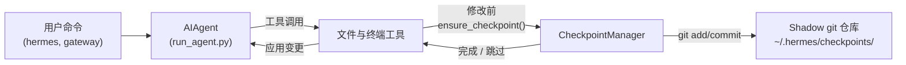

# 检查点（Checkpoints）与 `/rollback`

Hermes Agent 会在执行**破坏性操作**之前自动为你的项目创建快照，并允许你用一条命令将项目恢复到之前的状态。检查点**默认启用**——没有触发任何文件修改操作时，开销为零。

底层由内部组件 **Checkpoint Manager** 实现，它在 `~/.hermes/checkpoints/` 目录下维护一个独立的 shadow git 仓库，不会对你项目真正的 `.git` 目录造成任何影响。

## 什么操作会触发检查点

系统会在以下操作执行前自动创建检查点：

- **文件工具** — `write_file` 和 `patch`
- **破坏性终端命令** — `rm`、`mv`、`sed -i`、`truncate`、`shred`、输出重定向（`>`）以及 `git reset`/`clean`/`checkout`

每次对话轮次中，每个目录最多创建一个检查点，因此长时间运行的会话不会产生大量快照。

## 快速参考

| 命令 | 说明 |
|------|------|
| `/rollback` | 列出所有检查点及变更统计 |
| `/rollback <N>` | 恢复到第 N 个检查点（同时撤销最近一次对话轮次） |
| `/rollback diff <N>` | 预览第 N 个检查点与当前状态之间的 diff |
| `/rollback <N> <file>` | 从第 N 个检查点还原单个文件 |

## 检查点的工作原理

整体流程如下：

- 当有工具即将修改工作目录中的文件时，Hermes 会提前介入。
- 每次对话轮次中（每个目录执行一次）：
  - 为该文件推断出合理的项目根目录。
  - 初始化或复用与该目录绑定的 **shadow git 仓库**。
  - 将当前状态暂存并提交，附带简短易读的原因说明。
- 这些提交构成检查点历史，可通过 `/rollback` 查看和恢复。



## 配置

检查点默认启用。可在 `~/.hermes/config.yaml` 中进行配置：

```yaml
checkpoints:
  enabled: true          # 主开关（默认：true）
  max_snapshots: 50      # 每个目录最多保留的检查点数量
```

如需禁用：

```yaml
checkpoints:
  enabled: false
```

禁用后，Checkpoint Manager 将变为空操作，不再执行任何 git 操作。

## 查看检查点列表

在 CLI 会话中执行：

```
/rollback
```

Hermes 会以格式化列表返回各检查点的变更统计：

```text
📸 Checkpoints for /path/to/project:

  1. 4270a8c  2026-03-16 04:36  before patch  (1 file, +1/-0)
  2. eaf4c1f  2026-03-16 04:35  before write_file
  3. b3f9d2e  2026-03-16 04:34  before terminal: sed -i s/old/new/ config.py  (1 file, +1/-1)

  /rollback <N>             restore to checkpoint N
  /rollback diff <N>        preview changes since checkpoint N
  /rollback <N> <file>      restore a single file from checkpoint N
```

每条记录包含：

- 短 hash
- 时间戳
- 触发原因（哪个操作触发了本次快照）
- 变更摘要（修改的文件数、插入/删除行数）

## 用 `/rollback diff` 预览变更

在正式恢复之前，先预览自某个检查点以来发生了哪些变化：

```
/rollback diff 1
```

命令会先输出 diff 统计，再展示完整的变更内容：

```text
test.py | 2 +-
 1 file changed, 1 insertion(+), 1 deletion(-)

diff --git a/test.py b/test.py
--- a/test.py
+++ b/test.py
@@ -1 +1 @@
-print('original content')
+print('modified content')
```

为避免输出过长，diff 内容上限为 80 行。

## 用 `/rollback` 恢复

按编号恢复到指定检查点：

```
/rollback 1
```

Hermes 在后台执行以下步骤：

1. 验证目标提交在 shadow 仓库中是否存在。
2. 对当前状态创建一个**回滚前快照**，以便后续可以撤销这次"撤销"本身。
3. 将工作目录中受追踪的文件恢复至检查点状态。
4. **撤销最近一次对话轮次**，使智能体的上下文与已恢复的文件系统状态保持一致。

成功后输出：

```text
✅ Restored to checkpoint 4270a8c5: before patch
A pre-rollback snapshot was saved automatically.
(^_^)b Undid 4 message(s). Removed: "Now update test.py to ..."
  4 message(s) remaining in history.
  Chat turn undone to match restored file state.
```

撤销对话轮次可确保智能体不会"记住"已被回滚的变更，从而避免下一轮次产生混乱。

## 单文件还原

如果只需要恢复某一个文件，而不影响目录中的其他内容：

```
/rollback 1 src/broken_file.py
```

当智能体对多个文件进行了修改、但只有某一个文件需要回退时，单文件还原功能就非常有用。

## 安全与性能保护机制

为保证检查点功能的安全性和执行效率，Hermes 内置了多项保护机制：

- **Git 可用性检查** — 若 `PATH` 中找不到 `git`，检查点功能会自动静默禁用。
- **目录范围限制** — Hermes 会跳过过于宽泛的目录，如根目录 `/` 和主目录 `$HOME`。
- **仓库规模限制** — 文件数超过 50,000 的目录会被跳过，以避免 git 操作缓慢。
- **无变更跳过** — 若自上次快照以来没有任何变更，本次检查点将被跳过。
- **错误不影响主流程** — Checkpoint Manager 内部的所有错误仅以调试级别记录，不会影响工具的正常运行。

## 检查点的存储位置

所有 shadow 仓库均存储在以下目录：

```text
~/.hermes/checkpoints/
  ├── <hash1>/   # 对应某个工作目录的 shadow git 仓库
  ├── <hash2>/
  └── ...
```

每个 `<hash>` 由对应工作目录的绝对路径派生而来。每个 shadow 仓库内部包含：

- 标准 git 内部结构（`HEAD`、`refs/`、`objects/`）
- 一个包含精选忽略规则的 `info/exclude` 文件
- 一个指向原始项目根目录的 `HERMES_WORKDIR` 文件

通常情况下，你无需手动操作这些文件。

## 最佳实践

- **建议保持检查点启用** — 默认开启，没有文件修改操作时开销为零。
- **恢复前先用 `/rollback diff` 预览** — 确认变更内容，选择正确的检查点。
- **优先使用 `/rollback` 而非 `git reset`** — 专门用于撤销智能体驱动的变更。
- **与 Git 工作树（worktree）结合使用** — 让每个 Hermes 会话运行在独立的工作树/分支上，将检查点作为额外的安全层。

如需了解如何在同一仓库并行运行多个智能体，请参阅 [Git 工作树](/user-guide/git-worktrees) 指南。
