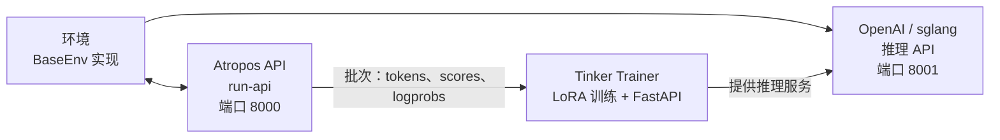

# 强化学习训练

Hermes Agent 内置了一套基于 **Tinker-Atropos** 的强化学习训练流水线。它支持通过 GRPO（组相对策略优化）和 LoRA 适配器，针对特定环境任务对语言模型进行强化学习训练，整个过程全程通过智能体的工具接口进行编排。

## 概述

强化学习训练系统由三个组件构成：

1. **Atropos** — 轨迹 API 服务器，负责协调环境交互、管理 rollout 组并计算优势值
2. **Tinker** — 训练服务，负责管理模型权重、LoRA 训练、采样/推理以及优化器步骤
3. **环境（Environments）** — 定义任务、评分和奖励函数的 Python 类（例如 GSM8K 数学题）

智能体可以发现环境、配置训练参数、启动训练任务并监控指标——所有操作均通过一组 `rl_*` 工具完成。

## 系统要求

强化学习训练需要以下条件：

- **Python >= 3.11**（Tinker 包的要求）
- **TINKER_API_KEY** — Tinker 训练服务的 API 密钥
- **WANDB_API_KEY** — Weights & Biases 指标跟踪的 API 密钥
- `tinker-atropos` 子模块（位于 Hermes 根目录下的 `tinker-atropos/`）

```bash
# 设置 API 密钥
hermes config set TINKER_API_KEY your-tinker-key
hermes config set WANDB_API_KEY your-wandb-key
```

当两个密钥均存在且 Python >= 3.11 可用时，`rl` 工具集将自动启用。

## 可用工具

| 工具 | 说明 |
|------|------|
| `rl_list_environments` | 发现可用的强化学习环境 |
| `rl_select_environment` | 选择环境并加载其配置 |
| `rl_get_current_config` | 查看可配置字段和锁定字段 |
| `rl_edit_config` | 修改可配置的训练参数 |
| `rl_start_training` | 启动训练任务（启动 3 个进程） |
| `rl_check_status` | 监控训练进度和 WandB 指标 |
| `rl_stop_training` | 停止正在运行的训练任务 |
| `rl_get_results` | 获取最终指标和模型权重路径 |
| `rl_list_runs` | 列出所有活跃和已完成的运行 |
| `rl_test_inference` | 使用 OpenRouter 进行快速推理测试 |

## 工作流

### 1. 发现环境

```
列出可用的强化学习环境
```

智能体调用 `rl_list_environments()`，该工具使用 AST 解析扫描 `tinker-atropos/tinker_atropos/environments/` 目录，查找继承自 `BaseEnv` 的 Python 类。每个环境定义了：

- **数据集加载** — 训练数据的来源（例如 HuggingFace 数据集）
- **提示词构造** — 如何为模型格式化输入项
- **评分/验证** — 如何评估模型输出并分配奖励

### 2. 选择并配置

```
选择 GSM8K 环境并显示配置
```

智能体先调用 `rl_select_environment("gsm8k_tinker")`，再调用 `rl_get_current_config()` 查看所有参数。

配置字段分为两类：

**可配置字段**（可修改）：
- `group_size` — 每个输入项的补全数量（默认：16）
- `batch_size` — 训练批次大小（默认：128）
- `wandb_name` — WandB 运行名称（自动设为 `{env}-{timestamp}`）
- 其他环境特定参数

**锁定字段**（基础设施配置，不可修改）：
- `tokenizer_name` — 模型分词器（例如 `Qwen/Qwen3-8B`）
- `rollout_server_url` — Atropos API URL（`http://localhost:8000`）
- `max_token_length` — 最大 token 长度（8192）
- `max_num_workers` — 最大并行 worker 数（2048）
- `total_steps` — 总训练步数（2500）
- `lora_rank` — LoRA 适配器秩（32）
- `learning_rate` — 学习率（4e-5）
- `max_token_trainer_length` — 训练器最大 token 数（9000）

### 3. 启动训练

```
启动训练任务
```

智能体调用 `rl_start_training()`，该方法会：

1. 生成 YAML 配置文件，合并锁定配置与可配置覆盖项
2. 创建唯一的运行 ID
3. 启动三个进程：
   - **Atropos API 服务器**（`run-api`）— 轨迹协调
   - **Tinker 训练器**（`launch_training.py`）— LoRA 训练 + FastAPI 推理服务器（端口 8001）
   - **环境**（`environment.py serve`）— 选定的环境连接到 Atropos

三个进程按错开的延迟顺序启动（API 延迟 5 秒、训练器延迟 30 秒、环境再延迟 90 秒），以确保正确的初始化顺序。

### 4. 监控进度

```
检查训练运行 abc12345 的状态
```

智能体调用 `rl_check_status(run_id)`，返回以下信息：

- 进程状态（三个进程各自的运行中/已退出状态）
- 已运行时间
- WandB 指标（步骤、奖励均值、正确率、评估准确率）
- 用于调试的日志文件位置

:::note
频率限制
状态检查受到频率限制，每个运行 ID 每 **30 分钟** 最多检查一次。这可防止对耗时数小时的训练任务进行过度轮询。
:::

### 5. 停止或获取结果

```
停止训练运行
# 或
获取运行 abc12345 的最终结果
```

`rl_stop_training()` 以反向顺序终止全部三个进程（环境 → 训练器 → API）。`rl_get_results()` 获取最终 WandB 指标和训练历史。

## 推理测试

在提交完整训练任务之前，你可以使用 `rl_test_inference` 测试环境是否正常运行。该工具通过 OpenRouter 执行少量推理和评分步骤——无需 Tinker API，只需一个 `OPENROUTER_API_KEY`。

```
对选定的环境进行推理测试
```

默认配置：
- **3 步 × 16 次补全 = 每个模型 48 次 rollout**
- 测试 3 个不同规模的模型以确保稳健性：
  - `qwen/qwen3-8b`（小型）
  - `z-ai/glm-4.7-flash`（中型）
  - `minimax/minimax-m2.7`（大型）
- 总计：约 144 次 rollout

此测试可验证：
- 环境是否能正确加载
- 提示词构造逻辑是否运行正常
- 推理响应解析在不同模型规模下是否稳健可靠
- 验证器/评分逻辑是否能产生有效奖励

## Tinker API 集成

训练器使用 [Tinker](https://tinker.computer) API 进行模型训练操作：

- **ServiceClient** — 创建训练客户端和采样客户端
- **训练客户端** — 使用重要性采样损失执行前向-反向传播、优化器步骤（Adam）以及权重检查点保存
- **采样客户端** — 使用最新训练权重提供推理服务

训练循环：
1. 从 Atropos 获取一批 rollout（提示词 + 补全内容 + 分数）
2. 转换为包含经填充处理的 logprobs 和优势值的 Tinker Datum 对象
3. 使用重要性采样损失执行前向-反向传播
4. 执行优化器步骤（Adam：lr=4e-5，β1=0.9，β2=0.95）
5. 保存权重并创建新的采样客户端用于下一步推理
6. 将指标记录到 WandB

## 架构图



## 创建自定义环境

创建新的强化学习环境的步骤：

1. 在 `tinker-atropos/tinker_atropos/environments/` 中创建一个 Python 文件
2. 定义一个继承自 `BaseEnv` 的类
3. 实现以下必要方法：
   - `load_dataset()` — 加载训练数据
   - `get_next_item()` — 向模型提供下一个输入项
   - `score_answer()` — 对模型输出评分并分配奖励
   - `collect_trajectories()` — 收集并返回轨迹
4. 可选：定义一个继承自 `BaseEnvConfig` 的自定义配置类

参考现有的 `gsm8k_tinker.py` 作为模板。智能体可以帮助你创建新环境——它能读取现有环境文件、检查 HuggingFace 数据集，并编写新的环境代码。

## WandB 指标

训练运行会将以下关键指标记录到 Weights & Biases：

| 指标 | 说明 |
|------|------|
| `train/loss` | 训练损失（重要性采样） |
| `train/learning_rate` | 当前学习率 |
| `reward/mean` | 各组的平均奖励 |
| `logprobs/mean` | 参考对数概率均值 |
| `logprobs/mean_training` | 训练对数概率均值 |
| `logprobs/diff` | 对数概率漂移（参考值 - 训练值） |
| `advantages/mean` | 优势值均值 |
| `advantages/std` | 优势值标准差 |

## 日志文件

每次训练运行会在 `~/.hermes/logs/rl_training/` 目录下生成日志文件：

```
logs/
├── api_{run_id}.log        # Atropos API server logs
├── trainer_{run_id}.log    # Tinker trainer logs
├── env_{run_id}.log        # Environment process logs
└── inference_tests/        # Inference test results
    ├── test_{env}_{model}.jsonl
    └── test_{env}_{model}.log
```

当训练失败或产生意外结果时，这些日志文件是排查问题的重要依据。
