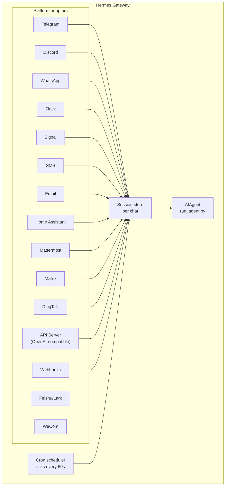

# 消息网关

通过 Telegram、Discord、Slack、WhatsApp、Signal、SMS、Email、Home Assistant、Mattermost、Matrix、DingTalk、Feishu/Lark、WeCom 或浏览器与 Hermes Agent 聊天。消息网关是一个单独的后台进程，负责连接所有已配置的平台、管理会话、运行定时任务，并投递语音消息。

完整的语音功能集——包括 CLI 麦克风模式、消息中的语音回复，以及 Discord 语音频道对话——请参阅[语音模式](https://hermes-agent.nousresearch.com/docs/user-guide/features/voice-mode)和[与 Hermes 使用语音模式](https://hermes-agent.nousresearch.com/docs/guides/use-voice-mode-with-hermes)。

## 平台对比

| 平台 | 语音 | 图片 | 文件 | 线程 | 表情反应 | 输入指示 | 流式传输 |
|----------|:-----:|:------:|:-----:|:-------:|:---------:|:------:|:---------:|
| Telegram | ✅ | ✅ | ✅ | ✅ | — | ✅ | ✅ |
| Discord | ✅ | ✅ | ✅ | ✅ | ✅ | ✅ | ✅ |
| Slack | ✅ | ✅ | ✅ | ✅ | ✅ | ✅ | ✅ |
| WhatsApp | — | ✅ | ✅ | — | — | ✅ | ✅ |
| Signal | — | ✅ | ✅ | — | — | ✅ | ✅ |
| SMS | — | — | — | — | — | — | — |
| Email | — | ✅ | ✅ | ✅ | — | — | — |
| Home Assistant | — | — | — | — | — | — | — |
| Mattermost | ✅ | ✅ | ✅ | ✅ | — | ✅ | ✅ |
| Matrix | ✅ | ✅ | ✅ | ✅ | — | ✅ | ✅ |
| DingTalk | — | — | — | — | — | ✅ | ✅ |
| Feishu/Lark | ✅ | ✅ | ✅ | ✅ | ✅ | ✅ | ✅ |
| WeCom | ✅ | ✅ | ✅ | — | — | ✅ | ✅ |

**语音** = TTS 音频回复和/或语音消息转录。**图片** = 收发图片。**文件** = 收发文件附件。**线程** = 线程对话。**表情反应** = 消息表情反应。**输入指示** = 处理中显示正在输入状态。**流式传输** = 通过消息编辑实现逐步更新。

## 架构



每个平台适配器接收消息，通过每个聊天的会话存储进行路由，再分发给 AIAgent 处理。网关还运行定时任务调度器，每 60 秒触发一次，执行到期的任务。

## 快速配置

配置消息平台最简便的方式是使用交互式向导：

```bash
hermes gateway setup        # 为所有消息平台进行交互式配置
```

向导通过方向键选择引导你配置每个平台，显示哪些平台已完成配置，并在完成后提示启动或重启网关。

## 网关命令

```bash
hermes gateway              # 在前台运行
hermes gateway setup        # 交互式配置消息平台
hermes gateway install      # 安装为用户服务（Linux）/ launchd 服务（macOS）
sudo hermes gateway install --system   # 仅 Linux：安装为开机自启的系统服务（仍以你的用户身份运行）
hermes gateway start        # 启动默认服务
hermes gateway stop         # 停止默认服务
hermes gateway status       # 查看默认服务状态
hermes gateway status --system         # 仅 Linux：显式查看系统服务状态
```

## 消息内聊天命令

| 命令 | 说明 |
|---------|-------------|
| `/new` 或 `/reset` | 开始新对话 |
| `/model [provider:model]` | 显示或切换模型（支持 `provider:model` 语法） |
| `/provider` | 显示可用提供商及认证状态 |
| `/personality [name]` | 设置个性化风格 |
| `/retry` | 重试上一条消息 |
| `/undo` | 撤销上一次对话 |
| `/status` | 显示会话信息 |
| `/stop` | 停止正在运行的智能体 |
| `/approve` | 批准待执行的危险命令 |
| `/deny` | 拒绝待执行的危险命令 |
| `/sethome` | 将当前聊天设为主频道 |
| `/compress` | 手动压缩对话上下文 |
| `/title [name]` | 设置或显示会话标题 |
| `/resume [name]` | 恢复之前命名的会话 |
| `/usage` | 显示本次会话的 token 用量 |
| `/insights [days]` | 显示用量洞察与分析 |
| `/reasoning [level\|show\|hide]` | 调整推理力度或切换推理显示 |
| `/voice [on\|off\|tts\|join\|leave\|status]` | 控制消息语音回复及 Discord 语音频道行为 |
| `/rollback [number]` | 列出或恢复文件系统检查点 |
| `/background ` | 在独立后台会话中运行提示词 |
| `/reload-mcp` | 从配置重新加载 MCP（Model Context Protocol）服务器 |
| `/update` | 将 Hermes Agent 更新至最新版本 |
| `/help` | 显示可用命令 |
| `/<skill>` | 调用任意已安装的技能 |

## 会话管理

### 会话持久化

会话在消息之间保持持久，直到被重置。智能体会记住你的对话上下文。

### 重置策略

会话根据可配置策略进行重置：

| 策略 | 默认值 | 说明 |
|--------|---------|-------------|
| 每日 | 凌晨 4:00 | 每天在指定时间重置 |
| 空闲 | 1440 分钟 | 无活动 N 分钟后重置 |
| 两者 | （组合） | 以先触发的为准 |

在 `~/.hermes/gateway.json` 中配置各平台的覆盖策略：

```json
{
  "reset_by_platform": {
    "telegram": { "mode": "idle", "idle_minutes": 240 },
    "discord": { "mode": "idle", "idle_minutes": 60 }
  }
}
```

## 安全

**默认情况下，网关拒绝所有不在允许列表中、且未通过私信配对的用户。** 对于具有终端访问权限的机器人，这是安全的默认设置。

```bash
# 限制特定用户（推荐）：
TELEGRAM_ALLOWED_USERS=123456789,987654321
DISCORD_ALLOWED_USERS=123456789012345678
SIGNAL_ALLOWED_USERS=+155****4567,+155****6543
SMS_ALLOWED_USERS=+155****4567,+155****6543
EMAIL_ALLOWED_USERS=trusted@example.com,colleague@work.com
MATTERMOST_ALLOWED_USERS=3uo8dkh1p7g1mfk49ear5fzs5c
MATRIX_ALLOWED_USERS=@alice:matrix.org
DINGTALK_ALLOWED_USERS=user-id-1

# 或允许
GATEWAY_ALLOWED_USERS=123456789,987654321

# 或显式允许所有用户（不建议用于具有终端访问权限的机器人）：
GATEWAY_ALLOW_ALL_USERS=true
```

### DM 配对（允许列表的替代方案）

无需手动配置用户 ID，未知用户在私信机器人时会收到一次性配对码：

```bash
# 用户看到："Pairing code: XKGH5N7P"
# 你通过以下命令批准：
hermes pairing approve telegram XKGH5N7P

# 其他配对命令：
hermes pairing list          # 查看待审核和已批准用户
hermes pairing revoke telegram 123456789  # 撤销访问权限
```

配对码 1 小时后过期，有频率限制，并使用密码学随机数生成。

## 中断智能体

在智能体运行期间发送任意消息即可中断它。关键行为：

- **正在执行的终端命令会被立即终止**（先发送 SIGTERM，1 秒后发送 SIGKILL）
- **工具调用会被取消** — 仅当前正在执行的工具继续运行，其余跳过
- **多条消息会被合并** — 中断期间发送的消息会合并成一条提示词
- **`/stop` 命令** — 中断智能体，但不加入后续消息队列

## 工具进度通知

在 `~/.hermes/config.yaml` 中控制工具活动的显示量：

```yaml
display:
  tool_progress: all    # off | new | all | verbose
  tool_progress_command: false  # 设为 true 可在消息中启用 /verbose
```

启用后，机器人在工作时会发送状态消息：

```text
💻 `ls -la`...
🔍 web_search...
📄 web_extract...
🐍 execute_code...
```

## 后台会话

在独立的后台会话中运行提示词，让智能体独立处理任务，同时保持主聊天的响应性：

```
/background Check all servers in the cluster and report any that are down
```

Hermes 会立即确认：

```
🔄 Background task started: "Check all servers in the cluster..."
   Task ID: bg_143022_a1b2c3
```

### 工作原理

每个 `/background` 提示词会生成一个**独立的智能体实例**并异步运行：

- **独立会话** — 后台智能体拥有自己的会话和对话历史，不了解当前聊天上下文，只接收你提供的提示词。
- **相同配置** — 继承当前网关配置中的模型、提供商、工具集、推理设置和提供商路由。
- **非阻塞** — 主聊天保持完全交互状态，可继续发送消息、运行其他命令，或同时启动更多后台任务。
- **结果投递** — 任务完成后，结果会发送回发出命令的**同一聊天或频道**，前缀为"✅ Background task complete"。如果失败，则显示"❌ Background task failed"及错误信息。

### 后台进程通知

当运行后台会话的智能体使用 `terminal(background=true)` 启动长时间运行的进程（服务器、构建等）时，网关可以向你的聊天推送状态更新。通过 `~/.hermes/config.yaml` 中的 `display.background_process_notifications` 控制：

```yaml
display:
  background_process_notifications: all    # all | result | error | off
```

| 模式 | 接收内容 |
|------|-----------------|
| `all` | 运行时输出更新**及**最终完成消息（默认） |
| `result` | 仅最终完成消息（无论退出码） |
| `error` | 仅退出码非零时的最终消息 |
| `off` | 不接收任何进程监视消息 |

也可通过环境变量设置：

```bash
HERMES_BACKGROUND_NOTIFICATIONS=result
```

### 使用场景

- **服务器监控** — "/background Check the health of all services and alert me if anything is down"
- **长时间构建** — "/background Build and deploy the staging environment"（在你继续聊天时进行）
- **研究任务** — "/background Research competitor pricing and summarize in a table"
- **文件操作** — "/background Organize the photos in ~/Downloads by date into folders"

:::tip
消息平台上的后台任务是即发即忘的——你无需等待或主动查看。任务完成后，结果会自动出现在同一聊天中。
:::

## 服务管理

### Linux（systemd）

```bash
hermes gateway install               # 安装为用户服务
hermes gateway start                 # 启动服务
hermes gateway stop                  # 停止服务
hermes gateway status                # 查看状态
journalctl --user -u hermes-gateway -f  # 查看日志

# 启用 linger（注销后继续运行）
sudo loginctl enable-linger $USER

# 或安装以你的用户身份运行的开机自启系统服务
sudo hermes gateway install --system
sudo hermes gateway start --system
sudo hermes gateway status --system
journalctl -u hermes-gateway -f
```

笔记本和开发机使用用户服务。VPS 或无头主机（开机后无需依赖 systemd linger 自动恢复运行）使用系统服务。

除非有意为之，否则避免同时安装用户和系统两个网关单元。若检测到两者同时存在，Hermes 会发出警告，因为 start/stop/status 的行为会变得不明确。

:::info
如果你在同一台机器上运行多个 Hermes 安装（使用不同的 `HERMES_HOME` 目录），每个安装会获得独立的 systemd 服务名。默认 `~/.hermes` 使用 `hermes-gateway`；其他安装使用 `hermes-gateway-`。`hermes gateway` 命令会自动定位到当前 `HERMES_HOME` 对应的正确服务。
:::

### macOS（launchd）

```bash
hermes gateway install               # 安装为 launchd agent
hermes gateway start                 # 启动服务
hermes gateway stop                  # 停止服务
hermes gateway status                # 查看状态
tail -f ~/.hermes/logs/gateway.log   # 查看日志
```

生成的 plist 文件位于 `~/Library/LaunchAgents/ai.hermes.gateway.plist`，包含以下三个环境变量：

- **PATH** — 安装时的完整 shell PATH，已在前面添加 venv `bin/` 和 `node_modules/.bin`。确保用户安装的工具（Node.js、ffmpeg 等）可供网关子进程（如 WhatsApp 桥接）使用。
- **VIRTUAL_ENV** — 指向 Python 虚拟环境，使工具可以正确解析包。
- **HERMES_HOME** — 将网关限定到你的 Hermes 安装目录。

:::tip
launchd plist 是静态的——如果你在配置网关后安装了新工具（如通过 nvm 安装新版 Node.js，或通过 Homebrew 安装 ffmpeg），请重新运行 `hermes gateway install` 以捕获更新后的 PATH。网关会检测到过期的 plist 并自动重新加载。
:::

:::info
与 Linux systemd 服务类似，每个 `HERMES_HOME` 目录会获得独立的 launchd label。默认 `~/.hermes` 使用 `ai.hermes.gateway`；其他安装使用 `ai.hermes.gateway-`。
:::

## 平台专属工具集

每个平台都有专属工具集：

| 平台 | 工具集 | 能力 |
|----------|---------|--------------|
| CLI | `hermes-cli` | 完全访问 |
| Telegram | `hermes-telegram` | 完整工具集（含终端） |
| Discord | `hermes-discord` | 完整工具集（含终端） |
| WhatsApp | `hermes-whatsapp` | 完整工具集（含终端） |
| Slack | `hermes-slack` | 完整工具集（含终端） |
| Signal | `hermes-signal` | 完整工具集（含终端） |
| SMS | `hermes-sms` | 完整工具集（含终端） |
| Email | `hermes-email` | 完整工具集（含终端） |
| Home Assistant | `hermes-homeassistant` | 完整工具集 + HA 设备控制（ha_list_entities, ha_get_state, ha_call_service, ha_list_services） |
| Mattermost | `hermes-mattermost` | 完整工具集（含终端） |
| Matrix | `hermes-matrix` | 完整工具集（含终端） |
| DingTalk | `hermes-dingtalk` | 完整工具集（含终端） |
| Feishu/Lark | `hermes-feishu` | 完整工具集（含终端） |
| WeCom | `hermes-wecom` | 完整工具集（含终端） |
| API Server | `hermes`（默认） | 完整工具集（含终端） |
| Webhooks | `hermes-webhook` | 完整工具集（含终端） |

## 下一步

- [Telegram 配置](/user-guide/messaging/telegram)
- [Discord 配置](/user-guide/messaging/discord)
- [Slack 配置](/user-guide/messaging/slack)
- [WhatsApp 配置](/user-guide/messaging/whatsapp)
- [Signal 配置](/user-guide/messaging/signal)
- [SMS 配置（Twilio）](/user-guide/messaging/sms)
- [邮件配置](/user-guide/messaging/email)
- [Home Assistant 集成](/user-guide/messaging/homeassistant)
- [Mattermost 配置](/user-guide/messaging/mattermost)
- [Matrix 配置](/user-guide/messaging/matrix)
- [DingTalk 配置](/user-guide/messaging/dingtalk)
- [Feishu/Lark 配置](/user-guide/messaging/feishu)
- [WeCom 配置](/user-guide/messaging/wecom)
- [Open WebUI + API Server](/user-guide/messaging/open-webui)
- [Webhooks](/user-guide/messaging/webhooks)
