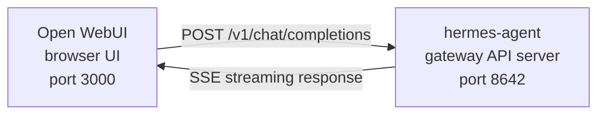

# Open WebUI 集成

[Open WebUI](https://github.com/open-webui/open-webui)（126k★）是目前最流行的自托管 AI 聊天界面。借助 Hermes Agent 内置的 API 服务器，你可以将 Open WebUI 作为智能体精致的 Web 前端——完整支持会话管理、用户账号和现代化聊天界面。

## 架构



Open WebUI 像连接 OpenAI 一样连接 Hermes Agent 的 API 服务器。你的智能体使用完整的工具集处理请求——终端、文件操作、网页搜索、记忆、技能——并返回最终响应。

Open WebUI 以服务器对服务器的方式与 Hermes 通信，因此此集成无需配置 `API_SERVER_CORS_ORIGINS`。

## 快速开始

### 1. 启用 API 服务器

在 `~/.hermes/.env` 中添加：

```bash
API_SERVER_ENABLED=true
API_SERVER_KEY=your-secret-key
```

### 2. 启动 Hermes Agent 网关

```bash
hermes gateway
```

你应该会看到：

```
[API Server] API server listening on http://127.0.0.1:8642
```

### 3. 启动 Open WebUI

```bash
docker run -d -p 3000:8080 \
  -e OPENAI_API_BASE_URL=http://host.docker.internal:8642/v1 \
  -e OPENAI_API_KEY=your-secret-key \
  --add-host=host.docker.internal:host-gateway \
  -v open-webui:/app/backend/data \
  --name open-webui \
  --restart always \
  ghcr.io/open-webui/open-webui:main
```

### 4. 打开界面

访问 [http://localhost:3000](http://localhost:3000)。创建管理员账号（第一个注册的用户成为管理员）。你应该能在模型下拉列表中看到 **hermes-agent**。开始聊天！

## Docker Compose 配置

如需更持久化的部署，创建 `docker-compose.yml`：

```yaml
services:
  open-webui:
    image: ghcr.io/open-webui/open-webui:main
    ports:
      - "3000:8080"
    volumes:
      - open-webui:/app/backend/data
    environment:
      - OPENAI_API_BASE_URL=http://host.docker.internal:8642/v1
      - OPENAI_API_KEY=your-secret-key
    extra_hosts:
      - "host.docker.internal:host-gateway"
    restart: always

volumes:
  open-webui:
```

然后运行：

```bash
docker compose up -d
```

## 通过管理界面配置

如果你倾向于通过界面而非环境变量配置连接：

1. 访问 [http://localhost:3000](http://localhost:3000) 登录 Open WebUI
2. 点击**头像** → **管理员设置**
3. 进入**连接**
4. 在 **OpenAI API** 下，点击**扳手图标**（管理）
5. 点击 **+ 添加新连接**
6. 填写：
   - **URL**：`http://host.docker.internal:8642/v1`
   - **API Key**：你的密钥，或任意非空值（如 `not-needed`）
7. 点击**对勾**验证连接
8. 点击**保存**

**hermes-agent** 模型应该会出现在模型下拉列表中。

:::caution
环境变量仅在 Open WebUI **首次启动**时生效。之后，连接配置会存储在其内部数据库中。如需修改，请使用管理界面，或删除 Docker 卷后重新启动。
:::

## API 类型：Chat Completions 与 Responses

Open WebUI 在连接后端时支持两种 API 模式：

| 模式 | 格式 | 使用场景 |
|------|------|----------|
| **Chat Completions**（默认） | `/v1/chat/completions` | 推荐。开箱即用。 |
| **Responses**（实验性） | `/v1/responses` | 通过 `previous_response_id` 在服务端维护会话状态。 |

### 使用 Chat Completions（推荐）

这是默认模式，无需额外配置。Open WebUI 发送标准 OpenAI 格式的请求，Hermes Agent 按规范响应。每次请求包含完整的会话历史。

### 使用 Responses API

启用 Responses API 模式：

1. 进入**管理员设置** → **连接** → **OpenAI** → **管理**
2. 编辑你的 hermes-agent 连接
3. 将 **API 类型**从"Chat Completions"改为 **"Responses（实验性）"**
4. 保存

使用 Responses API 时，Open WebUI 以 Responses 格式（`input` 数组 + `instructions`）发送请求，Hermes Agent 可通过 `previous_response_id` 跨轮次保留完整的工具调用历史。

:::note
即使在 Responses 模式下，Open WebUI 目前仍在客户端管理会话历史——每次请求都会发送完整的消息历史，而不是使用 `previous_response_id`。Responses API 模式主要是为了随着前端技术演进提供前向兼容性。
:::

## 工作原理

当你在 Open WebUI 中发送消息时：

1. Open WebUI 发送 `POST /v1/chat/completions` 请求，包含你的消息和会话历史
2. Hermes Agent 创建一个带有完整工具集的 AIAgent 实例
3. 智能体处理你的请求——可能会调用工具（终端、文件操作、网页搜索等）
4. 工具执行过程中，**内联进度消息会实时流式传输到界面**，让你看到智能体的行为（如 `` `💻 ls -la` ``、`` `🔍 Python 3.12 release` ``）
5. 智能体的最终文本响应流式返回给 Open WebUI
6. Open WebUI 在聊天界面中展示响应

无论是使用 CLI、Telegram 还是 Open WebUI，你的智能体都能访问完全相同的工具和能力——区别仅在于前端界面。

:::tip
工具运行进度
启用流式传输（默认启用）后，工具运行时你会看到简短的内联提示——工具 emoji 及其关键参数。这些提示会在智能体最终回答之前出现在响应流中，让你了解后台正在发生什么。
:::

## 配置参考

### Hermes Agent（API 服务器）

| 变量 | 默认值 | 说明 |
|------|--------|------|
| `API_SERVER_ENABLED` | `false` | 启用 API 服务器 |
| `API_SERVER_PORT` | `8642` | HTTP 服务器端口 |
| `API_SERVER_HOST` | `127.0.0.1` | 绑定地址 |
| `API_SERVER_KEY` | _（必填）_ | 认证用 Bearer token，需与 `OPENAI_API_KEY` 匹配 |

### Open WebUI

| 变量 | 说明 |
|------|------|
| `OPENAI_API_BASE_URL` | Hermes Agent 的 API URL（需包含 `/v1`） |
| `OPENAI_API_KEY` | 不能为空，需与 `API_SERVER_KEY` 匹配 |

## 故障排查

### 下拉列表中没有模型

- **检查 URL 是否包含 `/v1` 后缀**：应为 `http://host.docker.internal:8642/v1`（不能只有 `:8642`）
- **确认网关正在运行**：`curl http://localhost:8642/health` 应返回 `{"status": "ok"}`
- **检查模型列表**：`curl http://localhost:8642/v1/models` 应返回包含 `hermes-agent` 的列表
- **Docker 网络**：在 Docker 内部，`localhost` 指向容器本身，而非宿主机。请使用 `host.docker.internal` 或 `--network=host`。

### 连接测试通过但模型不加载

几乎总是缺少 `/v1` 后缀。Open WebUI 的连接测试只是基本的连通性检查，不验证模型列表是否正常工作。

### 响应时间过长

Hermes Agent 可能正在执行多次工具调用（读取文件、运行命令、搜索网页等）才生成最终响应。这对于复杂查询是正常现象。响应会在智能体完成后一次性返回。

### "Invalid API key" 错误

请确保 Open WebUI 中的 `OPENAI_API_KEY` 与 Hermes Agent 中的 `API_SERVER_KEY` 一致。

## Linux Docker（无 Docker Desktop）

在没有 Docker Desktop 的 Linux 环境中，`host.docker.internal` 默认无法解析。可选方案：

```bash
# 方案一：添加宿主机映射
docker run --add-host=host.docker.internal:host-gateway ...

# 方案二：使用宿主机网络
docker run --network=host -e OPENAI_API_BASE_URL=http://localhost:8642/v1 ...

# 方案三：使用 Docker 网桥 IP
docker run -e OPENAI_API_BASE_URL=http://172.17.0.1:8642/v1 ...
```
